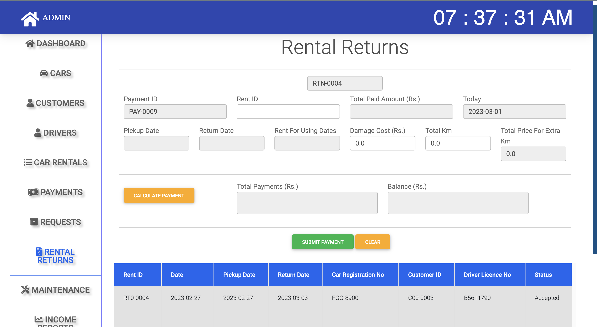

# Easy Car Rental

---

### Description.
* This is the spring framework project. 
* customers can register through the website and can buy cars for rental. 
* Admin can manage customer requests and rental requests and admin can add drivers into the system. if the customer 
wants a driver system will randomly pick a driver for the customer.
* The driver can log into the system using their username and password and 
can check does he have a reservation.

#### Role.
1. Admin.
2. Customer.
3. Driver.

### Languages & Tools

* HTML
* CSS
* Bootstrap
* Java Script
* Java
* SpringWebMVC
* Hibernate
* MySQL
* Maven (use Maven for dependency manage)
* Intellij IDEA
---

## Project View.

### ** Page Section **

#### Welcome Page

#### General-Car 

#### Premium-Cars

#### Luxury-Cars

#### Login-Interface

### ** Admin Page **

#### Admin-Dashboard

#### Admin-Add-Car

#### Admin-Manage-Customer

#### Admin-Add-Driver

#### Admin-Car-Rental-Details

#### Admin-Payment-Details

#### Admin-manage-Request

#### Admin-Rent-Return

#### Admin-Add-car-Maintenance

#### Admin-Income-Report

### ** Customer Page **

#### Customer-Profile

#### Customer-Place-Booking-Request

#### Customer-Booking-Response

#### Customer-Payment

### ** Driver Page **

#### Driver-Dashboard

